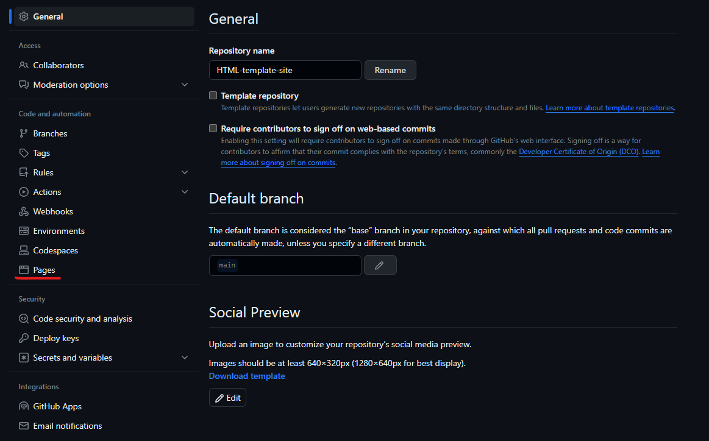
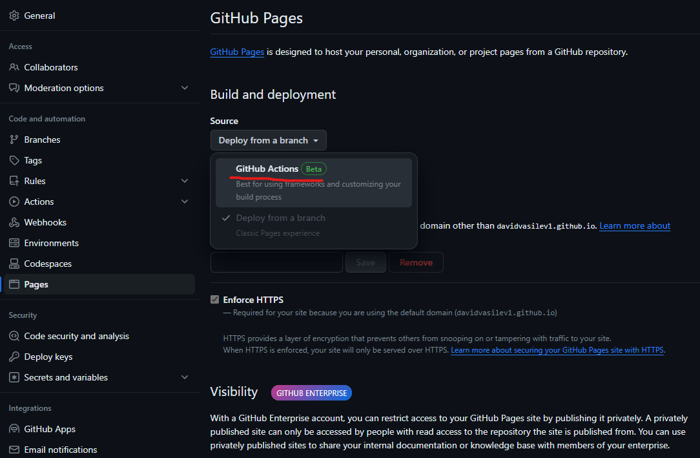
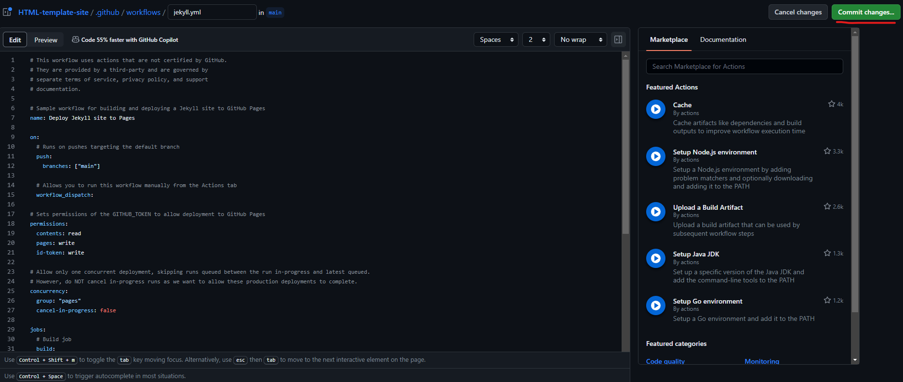

# Install Instructions

1. Install Dependencies: ```npm install```
2. Run Server: ```make```

## Install Node.js

1. ```sudo apt install nodejs```

# Personalize

- Change ```_config.yml```

## Set Up with Github Pages

- Find: Pages

- Find and Select: GitHub Actions

- Under the Jekyll card click: Configure

- Click: Commit Changes...


Your site should now be deployed under the ```github.io``` site that you set in ```_config.yml```.